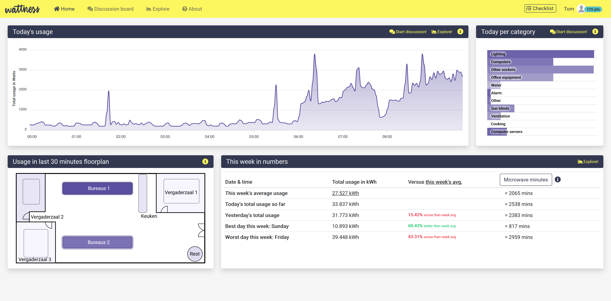
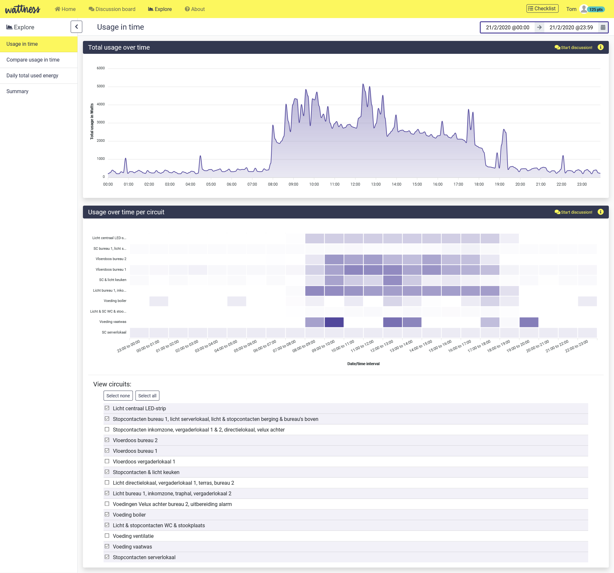
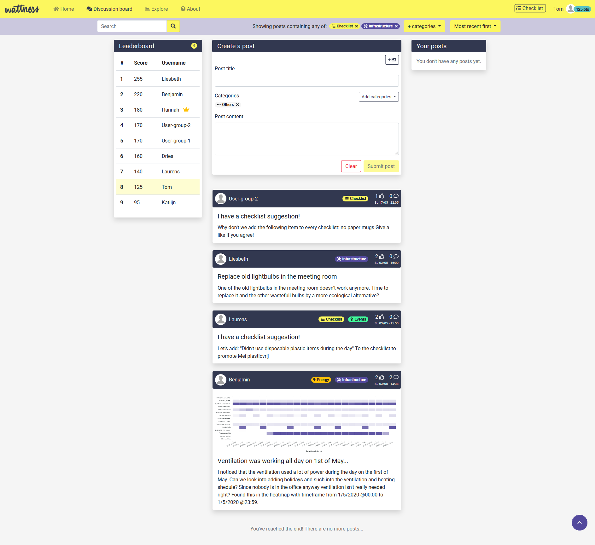

# Wattness office energy monitoring dashboard

This repository contains the code of a proof of concept energy monitoring dashboard that is supposed to help office workers act more sustainable in the workplace. This project is part of a master's thesis at the Human-Computer Interaction research group of KU Leuven. 

The dashboard can be viewed at  https://thesis-tom-bury.web.app . Please contact me for login credentials.

More information of this project can be found in the following blog post: https://www.statik.be/blog/naar-een-prototype-van-het-wattnessdashboard-dankzij-user-centered-design

### Used technologies

##### Frontend:

- Angular 9
- Bootstrap
- ApexCharts

##### Backend:

- Google Firebase: Authentication, Storage, Database, Hosting, Cloud functions
